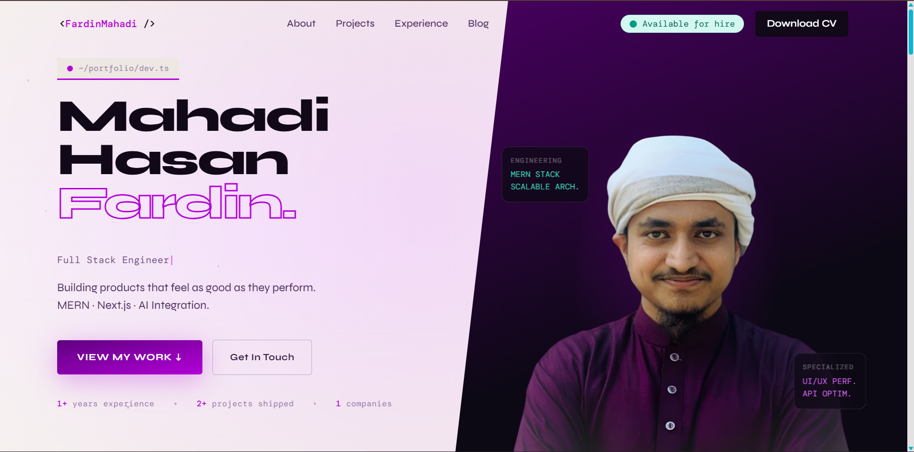

# 🎨 Fardin Mahadi Studio

> A motion-rich, theme-aware developer portfolio that transforms code into
> narrative experiences.

[](https://fardinmahadi.vercel.app/)
[](https://nextjs.org/)
[](https://www.typescriptlang.org/)
[](./LICENSE)



---

## 🌟 Overview

**Fardin Mahadi Studio** is more than a portfolio—it's a carefully orchestrated
experience that bridges thoughtful UX, performant engineering, and motion-driven
storytelling. Built by **Mahadi Hasan Fardin**, this platform showcases
projects, technical writing, and professional journey through a VS Code-inspired
interface that adapts to your visual preferences.

### Why This Portfolio Stands Out

- **🎭 Theme Intelligence** – Dynamic color palettes with instant transitions
  and localStorage persistence
- **✨ Motion Craftsmanship** – Seamless animations powered by Framer Motion and
  GSAP without sacrificing performance
- **🏗️ Architectural Elegance** – Type-safe, data-driven architecture using
  Next.js 15's App Router
- **📱 Responsive Excellence** – Fluid experiences from mobile to ultrawide
  displays
- **♿ Accessibility First** – WCAG-compliant components with keyboard
  navigation and screen reader support

---

## 🚀 Live Experience

**Production:** [fardinmahadi.vercel.app](https://fardinmahadi.vercel.app/)

Experience the portfolio in action—explore themed sections, interactive project
galleries, and blog content with real-time theme switching.

---

## ✨ Key Features

### 🎨 Dynamic Theming System

- **8+ Curated Palettes** – Cyan, violet, emerald, and more professional color
  schemes
- **Instant Theme Switching** – Zero-flicker transitions between themes
- **Persistent Preferences** – Your theme choice saves across sessions
- **Token-Based Design** – Consistent color application across all components

### 🎬 Rich Interactions & Motion

```typescript
// Cursor effects adapt to context
- Global animated cursor with magnetic buttons
- Blog-specific cursor with reading labels
- GSAP-powered hero animations
- Framer Motion reveals for sections and cards
```

- **Context-Aware Cursors** – Different cursor behaviors for different sections
- **Scroll-Triggered Reveals** – Elements animate into view as you scroll
- **Keyboard Navigation** – Full keyboard support for galleries and modals
- **Smooth Transitions** – View transitions API for seamless page changes

### 📝 Content Management

**JSON-Driven Architecture:**

- `projects.json` – Showcase your work with rich metadata
- `blogPosts.json` – Technical articles with Markdown rendering
- `socialLinks.json` – Centralized social media links

**Blog Features:**

- Category filtering
- Theme-aware cards
- SEO optimization with JSON-LD structured data
- Estimated reading time

### 🛠️ Developer Experience

- **TypeScript Throughout** – Full type safety from data to UI
- **Component Library** – Reusable shadcn/ui primitives
- **Consistent Formatting** – Automated Prettier + ESLint setup
- **Clear Documentation** – Comprehensive docs in `/docs` directory

---

## 🧰 Technology Stack

### Core Framework

- **[Next.js 15](https://nextjs.org/)** – React framework with App Router
- **[React 19](https://react.dev/)** – Latest React features
- **[TypeScript](https://www.typescriptlang.org/)** – Type-safe development

### Styling & Animation

- **[Tailwind CSS v4](https://tailwindcss.com/)** – Utility-first styling with
  custom tokens
- **[Framer Motion](https://www.framer.com/motion/)** – Production-ready motion
  library
- **[GSAP](https://greensock.com/gsap/)** – Advanced cursor animations

### UI Components & Tools

- **[shadcn/ui](https://ui.shadcn.com/)** – Accessible component primitives
- **[Lucide Icons](https://lucide.dev/)** – Beautiful, consistent iconography
- **[Resend](https://resend.com/)** – Reliable email API for contact forms

---

## 📦 Quick Start

### Prerequisites

- Node.js 18+
- pnpm (recommended) or npm

### Installation

```bash
# Clone the repository
git clone https://github.com/FardinMahadi/Portfolio.git
cd Portfolio

# Install dependencies
pnpm install

# Start development server
pnpm dev

# Open http://localhost:3000
```

### Build for Production

```bash
# Create optimized build
pnpm build

# Preview production build
pnpm start
```

### Code Formatting

```bash
# Format all files
pnpm format

# Check formatting without changes
pnpm format:check
```

---

## ⚙️ Configuration

### Environment Variables

Create a `.env.local` file for contact form functionality:

```env
# Resend API Configuration
RESEND_API_KEY=re_your_api_key_here
CONTACT_EMAIL=your-email@example.com
RESEND_FROM_EMAIL=onboarding@resend.dev
```

Get your Resend API key at [resend.com](https://resend.com/)

### Theme Customization

Modify color palettes in `src/lib/colorPalettes.ts`:

```typescript
export const palettes = {
  myCustomTheme: {
    name: 'Custom',
    colors: {
      primary: '#your-color',
      secondary: '#your-color',
      // ... more colors
    },
  },
};
```

---

## 📁 Project Structure

```
Portfolio/
├── src/
│   ├── app/                      # Next.js App Router
│   │   ├── layout.tsx           # Root layout with theme provider
│   │   ├── page.tsx             # Landing page composition
│   │   ├── blog/                # Blog routes
│   │   │   ├── page.tsx         # Blog index
│   │   │   └── [slug]/          # Individual blog posts
│   │   ├── not-found.tsx        # Custom 404 page
│   │   └── api/
│   │       └── contact/         # Contact form API endpoint
│   │
│   ├── components/
│   │   ├── LandingPage/         # Main sections
│   │   │   ├── HeroSection.tsx
│   │   │   ├── AboutSection.tsx
│   │   │   ├── ProjectsSection.tsx
│   │   │   ├── BlogSection.tsx
│   │   │   └── ContactSection.tsx
│   │   ├── blog/                # Blog components
│   │   │   ├── BlogIndexPage.tsx
│   │   │   └── BlogPostContent.tsx
│   │   ├── effects/             # Interactive effects
│   │   │   ├── TargetCursor.tsx
│   │   │   ├── CursorFollow.tsx
│   │   │   └── ScrollIndicator.tsx
│   │   ├── types/               # TypeScript interfaces
│   │   └── ui/                  # shadcn/ui components
│   │
│   ├── contexts/
│   │   └── ColorPaletteContext.tsx  # Theme state management
│   │
│   ├── data/                    # Content data
│   │   ├── projects.json
│   │   ├── blogPosts.json
│   │   └── socialLinks.json
│   │
│   ├── lib/                     # Utilities & helpers
│   │   ├── colorPalettes.ts    # Theme definitions
│   │   ├── projects.ts         # Data loaders
│   │   └── seo.ts              # SEO utilities
│   │
│   └── styles/
│       └── globals.css          # Tailwind configuration
│
├── public/                      # Static assets
│   └── Images/
│
├── docs/                        # Documentation
│   ├── README.md
│   ├── reference/
│   ├── ai/
│   └── getting-started/
│
└── package.json
```

---

## 📝 Content Management

### Adding Projects

Edit `src/data/projects.json`:

```json
{
  "id": "unique-project-id",
  "title": "Project Name",
  "description": "Brief description",
  "tags": ["React", "TypeScript", "Next.js"],
  "image": "/path/to/image.png",
  "liveUrl": "https://project-url.com",
  "githubUrl": "https://github.com/user/repo"
}
```

### Writing Blog Posts

Add entries to `src/data/blogPosts.json`:

```json
{
  "slug": "post-url-slug",
  "title": "Post Title",
  "excerpt": "Brief summary",
  "date": "2024-01-01",
  "category": "Tutorial",
  "content": "# Your Markdown Content\n\n..."
}
```

### Updating Social Links

Modify `src/data/socialLinks.json`:

```json
{
  "platform": "GitHub",
  "url": "https://github.com/username",
  "icon": "github"
}
```

---

## 🎨 Theming Guide

### Available Palettes

- **Cyan** – Cool, professional developer aesthetic
- **Blue** – Classic, trustworthy corporate feel
- **Violet** – Creative, modern personality
- **Emerald** – Fresh, eco-friendly vibe
- **Rose** – Warm, approachable design
- **Amber** – Energetic, optimistic tone
- **Slate** – Minimal, sophisticated look
- **Red** – Bold, passionate expression

### How Theming Works

1. **Context Provider** – `ColorPaletteContext` manages theme state
2. **CSS Variables** – Themes map to CSS custom properties
3. **Tailwind Utilities** – Components use theme-aware classes
4. **LocalStorage** – Preferences persist across sessions

```tsx
// Using theme in components
<div className="bg-(--color-background) text-(--color-text)">
  <h1 className="text-theme-primary">Hello</h1>
</div>
```

---

## 🧩 Key Components Deep Dive

### ProjectsSection

**Purpose:** Showcase portfolio work with interactive gallery

**Features:**

- Grid layout with hover effects
- Lightbox modal with keyboard navigation
- Theme-aware overlays
- Tag filtering

### BlogIndexPage

**Purpose:** Browse technical writing and articles

**Features:**

- Category-based filtering
- Theme-aware card designs
- SEO optimization with structured data
- Reading time estimates

### ContactSection

**Purpose:** Professional contact form with social links

**Features:**

- Terminal-styled interface
- Resend email integration
- Form validation
- JSON-driven social media links

### Cursor Effects

**Purpose:** Add personality and interactivity

**Types:**

- `TargetCursor` – Global animated cursor (non-blog routes)
- `CursorFollow` – Blog-specific reading aid
- Magnetic buttons for enhanced interactivity

---

## 🚀 Deployment

### Vercel (Recommended)

```bash
# Install Vercel CLI
pnpm add -g vercel

# Deploy
vercel

# Production deployment
vercel --prod
```

### Netlify

```bash
# Install Netlify CLI
pnpm add -g netlify-cli

# Deploy
netlify deploy --prod
```

### Manual Deployment

```bash
# Build static files
pnpm build

# The .next/ folder contains your production build
# Upload to any static hosting service
```

### Environment Variables

Don't forget to add your environment variables to your deployment platform:

- `RESEND_API_KEY`
- `CONTACT_EMAIL`
- `RESEND_FROM_EMAIL`

---

## 🤝 Contributing

Contributions are welcome! Whether it's bug fixes, feature additions, or
documentation improvements, your input helps make this portfolio better.

### How to Contribute

1. **Fork the repository**
2. **Create a feature branch** (`git checkout -b feature/AmazingFeature`)
3. **Commit changes** (`git commit -m 'Add some AmazingFeature'`)
4. **Push to branch** (`git push origin feature/AmazingFeature`)
5. **Open a Pull Request**

### Guidelines

Please review our documentation before contributing:

- [Style Guide](./docs/reference/style-guide.md) – Code formatting and
  conventions
- [AI Training Guide](./docs/ai/training-guide.md) – AI-assisted development
- [Contributing Guide](./docs/getting-started/contributing.md) – Contribution
  process
- [Documentation Index](./docs/README.md) – Full documentation overview

### Code Quality

- Write TypeScript with proper typing
- Follow the existing component structure
- Add comments for complex logic
- Test your changes thoroughly
- Run `pnpm format` before committing

---

## 📚 Documentation

Comprehensive documentation is available in the `/docs` directory:

- **Getting Started** – Setup, configuration, and basic usage
- **Reference** – API documentation and component guides
- **AI Guides** – AI-assisted development workflows
- **Architecture** – System design and decisions

---

## 🐛 Known Issues & Roadmap

### Current Limitations

- Contact form requires Resend API key
- Blog content is static (no CMS integration yet)
- Limited to 8 predefined themes

### Future Enhancements

- [ ] CMS integration for blog management
- [ ] Performance analytics dashboard
- [ ] Resume PDF generation
- [ ] Project case study pages
- [ ] Newsletter subscription
- [ ] Code snippet syntax highlighting improvements

---

## 📄 License

This project is licensed under the **MIT License** – see the
[LICENSE](./LICENSE) file for details.

```
MIT License

Copyright (c) 2024 Mahadi Hasan Fardin

Permission is hereby granted, free of charge, to any person obtaining a copy
of this software and associated documentation files (the "Software"), to deal
in the Software without restriction...
```

---

## 👤 About the Author

**Mahadi Hasan Fardin**  
Full-Stack Developer & UX Enthusiast

I specialize in creating performant, accessible web experiences that blend
thoughtful design with robust engineering. This portfolio represents my
commitment to craftsmanship in both code and user experience.

### Connect With Me

[](https://fardinmahadi.vercel.app/)
[](https://github.com/FardinMahadi)
[](https://www.linkedin.com/in/mahadi-hasan-fardin)

---

## 🙏 Acknowledgments

- **Next.js Team** – For an incredible React framework
- **Vercel** – For seamless deployment platform
- **shadcn** – For beautiful, accessible components
- **Tailwind Labs** – For the utility-first CSS revolution
- **Open Source Community** – For countless tools and inspiration

---

## ⭐ Show Your Support

If this portfolio inspires you or helps with your own projects, please consider:

- ⭐ **Starring the repository**
- 🐛 **Reporting bugs or issues**
- 💡 **Suggesting new features**
- 🔀 **Contributing code**
- 📢 **Sharing with others**

---

<div align="center">

**[↑ Back to Top](#-fardin-mahadi-studio)**

Made with ❤️ by [Mahadi Hasan Fardin](https://fardinmahadi.vercel.app/)

</div>
